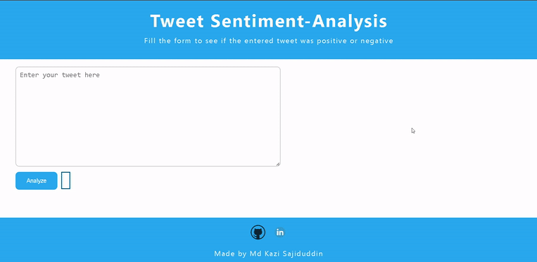

# Tweet Sentiment-Analysis


## Table of Contents

 - [Demo](#demo)
 - [Overview](#overview)
 - [Motivation](#motivation)
 - [Installation](#installation)
 - [Deployement on Cpanel](#deployement-on-cpanel)
 - [Directory Tree](#directory-tree)
 - [Bug / Feature Request](#bug--feature-request)
 - [Future scope of project](#future-scope)
 - [Credits](#credits)

## Demo
- Link: 

- Please do ⭐ the repository, if it helped you in anyway.

- A glimpse of the web app:



## Overview
This is a Flask web app which analyzes whether the entered tweet is positive or negative.

## Motivation
I started to learn Data Sience during second year of my college as this subject intrigued me quite a lot. So i started with Machine Learning first and came to know mathematics behind all supervised as well as unsupervised models. Finally it is important to work on application (real world application) to actually make a difference.

## Installation
The Code is written in Python 3.10.10. If you don't have Python installed you can find it [here](https://www.python.org/downloads/). If you are using a lower version of Python you can upgrade using the pip package, ensuring you have the latest version of pip. To install the required packages and libraries, run this command in the project directory after [cloning](https://www.howtogeek.com/451360/how-to-clone-a-github-repository/) the repository:

```bash
pip install -r requirements.txt
```
## Deployement on Cpanel
Click [here](https://docs.cpanel.net/knowledge-base/web-services/guide-to-git-how-to-set-up-deployment/) to see how to deploy your machine learning model on Cpanel.

## Directory Tree

```
├── resource 
│   ├── tweet.gif
├── static 
│   ├── css
│         ├── style.css
├── template
│   ├── index.html
├── .gitattributes
├── Procfile
├── README.md
├── app.py
├── cv-transform.pkl
├── requirements.txt
├── sentiment-analysis.ipynb
├── training.1600000.processed.noemoticon.csv
├── tweetmodel.pkl
```

## Bug / Feature Request

If you find a bug (the website couldn't handle the query and / or gave undesired results), kindly open an [issue](https://github.com/Sajid030/tweet-sentiment-analysis/issues) here by including your search query and the expected result

## Future Scope

- Use multiple Algorithms
- Optimize Flask app.py
- Front-End 

## Credits
- Dataset link : Click [here](https://www.kaggle.com/datasets/kazanova/sentiment140?select=training.1600000.processed.noemoticon.csv)
